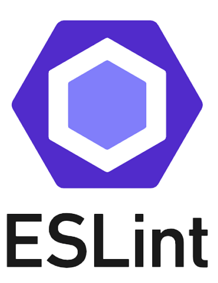
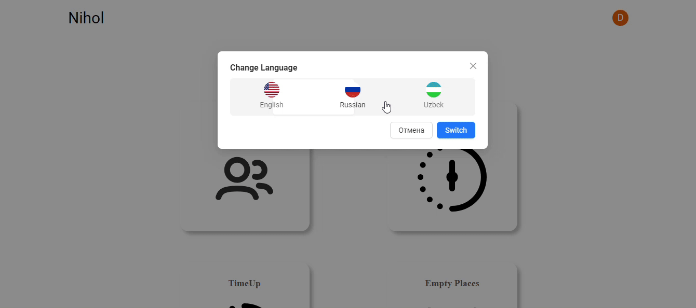

  <h1 align="center">👋 Hi, I'm Dawlet </h1>

📍 I am from Uzbekistan .

📚 I study the relevant literature, take courses, master new technologies, and level up my English.

🧠 The more knowledge I get, the closer I get to becoming a coding master. Or at least, that's the plan! 🚀

📩 So, send your offers and internships - I'm all ears. 📩

 

  
  
  
   
   

 

<h3>🛠️ The tech stack I've worked with in my job</h3>

&nbsp; 
&nbsp; 
&nbsp; 
  &nbsp; 
&nbsp; 
&nbsp; 
&nbsp; 
&nbsp; 
&nbsp; 
&nbsp; 
&nbsp; 
&nbsp; 
&nbsp;
  &nbsp;

<h3>💻 My projects</h3>
          <table>
            <tbody>
            <td colspan="2">
                  <h3 align="center">DevOverFlow</h3>
                </td>
              </tr>
              <tr>
                <td rowspan="3" width="50%">
                  
                </td>
              </tr>
              <tr>
                <td>
                  

                    
                    
                    
                    
                  

                </td>
              </tr>
              <tr>
                <td>
                  
<b>About project</b>

          

            This project aims to create a community-driven platform where developers can seek help, share knowledge, and collaborate on solving programming challenges, much like the functionality offered by Stack Overflow.
            <h4>
              Things I learned and worked with
            </h4>
            <ul>
              <li>WebHooks</li>
              <li>Server Side Rendering</li>
              <li>RunTime&BuildTime</li>
              <li>Client vs Server Architecture</li>
              <li>Dynamic Routes</li>
              <li>Mongoose</li>
              <li>Integration of OpenAi</li>
            </ul>
          

          

            <a target="_blank" href="https://github.com/DawletKenesbaev/dev_overflow_nextjs14" title="Go to the repository">More →</a>
          

                </td>
              </tr>
             </tr>
             <tr>
                <td colspan="2">
                  <h3 align="center">Nihol</h3>
                </td>
              </tr>
              <tr>
                <td rowspan="3" width="50%">
                  
                </td>
              </tr>
              <tr>
                <td>
                  

                    
                    
                    
                    
                  

                </td>
              </tr>
              <tr>
                <td>
                  
<b>About project</b>

                  

                    This project is a Sanatorium Management System, designed to help sanatoriums manage their customers, their stay durations, and payment information effectively. The system acts as an admin panel where administrators can view, add, update, and delete customer information, track payments, and manage stay durations.
                    <h4>Things I learned and worked with</h4>
                    <ul>
                      <li>Authentication</li>
                      <li>Redux ToolKit</li>
                      <li>React Router</li>
                      <li>i18 (multi languages)</li>
                      <li>Ant Design</li>
                      <li>Cashe,Session vs Local Storage</li>
                    </ul>
                  

                    <a href="https://github.com/DawletKenesbaev/Nihol" title="Go to the repository">More →</a>
                  

                </td>
              </tr>
                  </tr>
          </tbody>
          </table>

